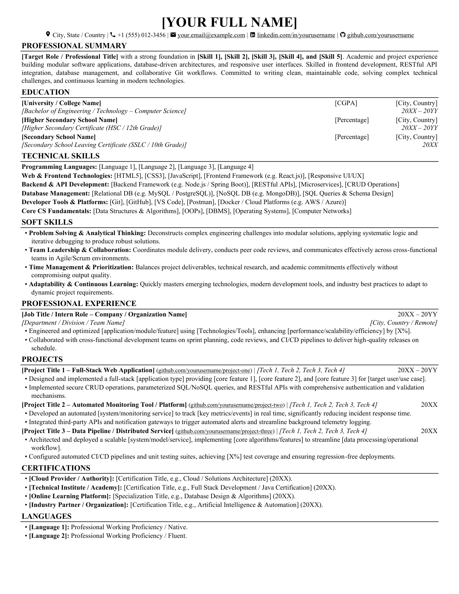

# Modern ATS Resume Generation Script (DOCX & PDF)

[](https://www.python.org/)
[]()
[]()
[]()
[]()

An automated, engineering-grade Python script for generating professional, single-page, ATS-optimized resumes in both **Microsoft Word (.docx)** and **Adobe PDF (.pdf)** formats.

This template incorporates the typography, tab-stop alignments, margin geometry, and section structures proven across technical roles (Software Engineering, Full-Stack, AI/ML, Automation).

---

## Visual Preview

Below is the exact output generated by `generate_resume_template.py`:



---

## Table of Contents

1. [Key Features](#key-features)
2. [What You Can Do With This Script](#what-you-can-do-with-this-script)
3. [Repository Structure](#repository-structure)
4. [Detailed Function-by-Function Documentation](#detailed-function-by-function-documentation)
   - [`set_run_font`](#1-set_run_font)
   - [`add_hyperlink`](#2-add_hyperlink)
   - [`add_icon`](#3-add_icon)
   - [`create_resume`](#4-create_resume)
     - [`add_section_heading`](#41-add_section_heading)
     - [`add_two_column_row`](#42-add_two_column_row)
     - [`add_three_column_row`](#43-add_three_column_row)
     - [`add_project_header`](#44-add_project_header)
     - [`add_bullet_point`](#45-add_bullet_point)
     - [`add_skill_row`](#46-add_skill_row)
   - [`convert_docx_to_pdf`](#5-convert_docx_to_pdf)
   - [`check_pdf_pages`](#6-check_pdf_pages)
5. [Customization Guide: What & Where to Replace](#customization-guide-what--where-to-replace)
6. [1-Page Layout Geometry & Spacing Rules](#1-page-layout-geometry--spacing-rules)
7. [Installation & Requirements](#installation--requirements)
8. [How to Run](#how-to-run)
9. [Troubleshooting & FAQs](#troubleshooting--faqs)

---

## Key Features

- **Guaranteed Strict 1-Page Fit**: Mathematically budgeted spacing (0.25" top/bottom, 0.40" left/right margins, 9.25pt base font) ensuring no awkward second page spills while maintaining ~70–95 pt of bottom breathing room.
- **ATS Parsing Optimization**: Uses clean standard text paragraphs with tab-stop alignments rather than nested tables or text boxes, which frequently scramble Applicant Tracking System (ATS) parsers.
- **Clickable Hyperlinks**: Functional, underlined hyperlinks for Email (`mailto:`), LinkedIn, GitHub profile, and individual project repositories.
- **High-Resolution Contact Icons**: Pixel-aligned PNG icons for location, phone, email, LinkedIn, and GitHub with vertical half-point positioning.
- **Dual Format Generation**: Instantly produces both editable `.docx` and high-fidelity `.pdf`.
- **Automated Validation**: Built-in PyMuPDF page inspector that checks bounding boxes and alerts you if content exceeds 1 page.
- **AI-Agent & Human Friendly**: The code is heavily annotated so any developer, recruiter, or AI coding agent can update it effortlessly.

---

## What You Can Do With This Script

1. **Create Your Own Resume**:
   Open `generate_resume_template.py`, edit the `RESUME_DATA` dictionary at the top with your personal information, skills, and projects, and run the script.
2. **Automate Resume Variations for Different Job Applications**:
   Create different versions of the `RESUME_DATA` dictionary (e.g., Frontend, Backend, Data Science, DevOps) and generate tailored resumes programmatically.
3. **Use with AI Assistants & Agents**:
   Pass this repository or script to an AI assistant (like ChatGPT, Claude, or Gemini) with the prompt: *"Here is my experience and the template script; populate `RESUME_DATA` for a Senior Backend Engineer role."* The agent will understand the schema and produce your custom resume.
4. **Export Clean PDF and DOCX**:
   Share the `.pdf` with recruiters and keep the `.docx` for forms or recruiters who explicitly request Word documents.

---

## Repository Structure

```
├── generate_resume_template.py         # Main generator script with configuration & builder
├── General_Resume_Template.docx        # Generated Word Document template
├── General_Resume_Template.pdf         # Generated PDF Document template
├── General_Resume_Template_preview.png # Visual preview of the 1-page template
├── icons/                              # Contact line vector icons (PNG format)
│   ├── github.png                      # GitHub icon
│   ├── linkedin.png                    # LinkedIn icon
│   ├── mail.png                        # Email envelope icon
│   ├── phone.png                       # Phone handset icon
│   └── pin.png                         # Location pin icon
├── requirements.txt                    # Python package dependencies
└── README.md                           # Documentation & user manual
```

---

## Detailed Function-by-Function Documentation

### 1. `set_run_font`
```python
def set_run_font(run, font_name="Times New Roman", size_pt=9.25, bold=False, italic=False, color_rgb=(0, 0, 0)):
```
- **Purpose**: Applies strict font family, size, weight, styling, and color to a specific Word run (`docx.text.run.Run`).
- **Why It's Needed**: In `python-docx`, setting `run.font.name` alone does not reliably embed fonts across all platforms or during PDF conversion. This function directly appends the `<w:rFonts>` XML node for `ascii`, `hAnsi`, and `cs` (complex scripts), ensuring uniform rendering in Times New Roman.
- **Parameters**:
  - `run`: Target run object.
  - `font_name`: Name of the typeface (default: `"Times New Roman"`).
  - `size_pt`: Font size in points (default: `9.25`).
  - `bold`: Boolean flag for bold weight.
  - `italic`: Boolean flag for italic styling.
  - `color_rgb`: Tuple of RGB integers (default: `(0, 0, 0)`).

---

### 2. `add_hyperlink`
```python
def add_hyperlink(paragraph, url, text, font_name="Times New Roman", font_size_pt=8.8, color="000000", underline=True):
```
- **Purpose**: Inserts a clickable, ATS-compliant hyperlink into a paragraph.
- **Why It's Needed**: Standard `python-docx` lacks a built-in method for inserting external hyperlinks. This function creates an Open Packaging Convention (OPC) relationship ID in the document part and injects the `<w:hyperlink>` and `<w:r>` XML elements.
- **Parameters**:
  - `paragraph`: Target paragraph object.
  - `url`: Destination URL (e.g., `'https://github.com/username'` or `'mailto:user@mail.com'`).
  - `text`: Visible anchor text displayed in the document.
  - `font_name`: Font family (default: `'Times New Roman'`).
  - `font_size_pt`: Font size in points (default: `8.8`).
  - `color`: Hex color string without `#` (default: `'000000'`).
  - `underline`: Boolean flag to enable standard hyperlink underline (default: `True`).

---

### 3. `add_icon`
```python
def add_icon(paragraph, icon_name, size_pt=8.0, offset_val="-2"):
```
- **Purpose**: Inserts an icon image from the `icons/` directory with vertical alignment adjustment.
- **Why It's Needed**: Small inline icons often appear shifted upward relative to the baseline of text. This function injects a `<w:position>` XML element with a vertical offset (e.g., `-2` half-points) to align the icon with adjacent text. If the icon file is not found, it gracefully skips without crashing.
- **Parameters**:
  - `paragraph`: Target paragraph object.
  - `icon_name`: File base name inside `icons/` (e.g. `'pin'`, `'phone'`, `'mail'`, `'linkedin'`, `'github'`).
  - `size_pt`: Square dimension in points (default: `8.0`).
  - `offset_val`: Vertical position offset in half-points (default: `"-2"`).

---

### 4. `create_resume`
```python
def create_resume(data, output_path):
```
- **Purpose**: The master resume assembly engine. Configures document geometry, page margins (0.25" top/bottom, 0.40" left/right), Normal style defaults, and sequentially constructs each section using dedicated helper closures.
- **Parameters**:
  - `data`: A dictionary conforming to `RESUME_DATA`.
  - `output_path`: Destination path for the `.docx` file.

#### Internal Helper Closures inside `create_resume`:

#### 4.1 `add_section_heading`
```python
def add_section_heading(title, space_before=3.6, space_after=1.2):
```
Creates an ATS-compliant section header (e.g., `PROFESSIONAL SUMMARY`, `EDUCATION`, `PROJECTS`) featuring a solid 0.75pt bottom border rule (`<w:pBdr>`), 10.5pt bold text, and `keep_with_next = True` to prevent page orphans.

#### 4.2 `add_two_column_row`
```python
def add_two_column_row(left_text, right_text, left_bold=True, left_italic=False, right_bold=False, right_italic=False, space_before=1.1, space_after=0):
```
Creates a two-column row using a right-aligned tab stop at the right margin (`content_width = 7.70"`). Perfect for displaying degree names and graduation dates or roles and locations.

#### 4.3 `add_three_column_row`
```python
def add_three_column_row(left_text, mid_text, right_text, left_bold=True, left_italic=False, mid_bold=False, mid_italic=False, right_bold=False, right_italic=False, space_before=1.1, space_after=0):
```
Creates a three-column row using two tab stops:
1. `Inches(5.8)` (Left-aligned): for scores (`[CGPA]` or `[Percentage]`).
2. `Inches(7.70)` (Right-aligned): for locations (`[City, Country]`).
This eliminates the risk of text overlap while leaving ~5.8 inches for the institution name.

#### 4.4 `add_project_header`
```python
def add_project_header(title, tech_stack, date_text, github_url=None, github_text=None, space_before=1.2, space_after=0):
```
Formats project headers:
`[Project Title] (github.com/url) | [Tech Stack]              [Year]`
Includes the project title in bold, an optional clickable hyperlink in parentheses, italicized technologies, and right-aligned completion year.

#### 4.5 `add_bullet_point`
```python
def add_bullet_point(runs_data, space_before=0.8, space_after=0.8):
```
Creates an ATS-compliant bullet point (`• `) with hanging indentation (`left_indent = 0.18"`, `first_line_indent = -0.12"`). Accepts a list of `(text, is_bold, is_italic)` tuples to allow bold lead-ins.

#### 4.6 `add_skill_row`
```python
def add_skill_row(category, items, space_before=1.0, space_after=1.0):
```
Renders technical skills with a bold category label (e.g. `Programming Languages: `) followed by a regular-weight comma-separated list of technologies.

---

### 5. `convert_docx_to_pdf`
```python
def convert_docx_to_pdf(docx_path, pdf_path):
```
- **Purpose**: Converts the `.docx` document to `.pdf`.
- **Strategy**:
  1. **Primary**: Windows COM automation via `win32com.client.Dispatch('Word.Application')` using `FileFormat=17` (`wdFormatPDF`). This utilizes Microsoft Word's native typography engine for pixel-perfect fidelity.
  2. **Fallback**: `docx2pdf.convert`, ensuring conversion works in varied environment configurations.

---

### 6. `check_pdf_pages`
```python
def check_pdf_pages(pdf_path):
```
- **Purpose**: Validates strict 1-page compliance using PyMuPDF (`fitz`).
- **How It Works**:
  1. Opens the generated PDF and asserts `len(doc) == 1`.
  2. Iterates over text bounding boxes to calculate the maximum vertical coordinate (`max_y`).
  3. Computes the remaining bottom margin (`page_height - max_y`).
  4. Outputs a clear validation report in the terminal.

---

## Customization Guide: What & Where to Replace

All customization is performed inside the `RESUME_DATA` dictionary at the top of [`generate_resume_template.py`](generate_resume_template.py):

| Section | Dictionary Key | What to Replace | Example / Recommended Format |
|---|---|---|---|
| **Header** | `"header"` | Name, location, phone, email, LinkedIn, GitHub | `"name": "ALEXANDER SMITH"`<br>`"location": "New York, NY"` |
| **Summary** | `"summary_runs"` | Target role & 4–5 core skills | `("[Full Stack Engineer]", True, False)` |
| **Education** | `"education"` | College/School names, CGPA/Percentage, degree, dates | `"institution": "State University"`<br>`"score": "CGPA: 8.9 / 10.0"`<br>`"year": "2020 – 2024"` |
| **Tech Skills** | `"technical_skills"` | Categories & comma-separated tools | `("Languages", "Python, Java, TypeScript")` |
| **Soft Skills** | `"soft_skills"` | Skill title & impact description | `("Problem Solving: ", "Applies systematic debugging...")` |
| **Experience** | `"experience"` | Job title, company, dates, team, 2 bullet points | Quantifiable achievements using action verbs |
| **Projects** | `"projects"` | 2–3 projects with tech stack, optional repo URL, and 2 bullets | `"title": "E-Commerce Microservice"`<br>`"github_url": "https://github.com/..."` |
| **Certifications**| `"certifications"` | Provider & credential title with year | `("AWS: ", "Certified Solutions Architect (2024)")` |
| **Languages** | `"languages"` | Spoken languages & proficiency level | `("English: ", "Full Professional Proficiency")` |

---

## 1-Page Layout Geometry & Spacing Rules

To maintain an exact 1-page fit, the template adheres to the following specifications:

- **Paper Size**: US Letter (8.5" x 11.0" / 612.0 pt x 792.0 pt)
- **Margins**: Top: `0.25"`, Bottom: `0.25"`, Left: `0.40"`, Right: `0.40"`
- **Content Width**: `7.70"` (554.4 pt)
- **Base Typography**:
  - Name Header: `18.5 pt Bold`
  - Contact Line: `8.8 pt Regular`
  - Section Headings: `10.5 pt Bold` (with 0.75pt bottom border)
  - Body & Bullets: `9.25 pt Regular`
  - Line Spacing: `1.04 – 1.06`
- **Bottom Margin Clearance**: ~`70.0 – 95.0 pt` (~1.0 – 1.3 inches of safe margin).

---

## Installation & Requirements

### 1. Python Environment
Python 3.8 or higher is recommended.

### 2. Install Dependencies
```bash
pip install -r requirements.txt
```

Contents of `requirements.txt`:
```
python-docx>=0.8.11
PyMuPDF>=1.23.0
docx2pdf>=0.1.8
pypiwin32>=223; sys_platform == 'win32'
```

---

## How to Run

Execute the script from your terminal:

```bash
python generate_resume_template.py
```

### Expected Output:
```text
Generating general resume template...
Successfully generated DOCX: General_Resume_Template.docx
Successfully generated PDF: General_Resume_Template.pdf
Validation: Total pages in General_Resume_Template.pdf = 1
Page Height: 792.0 pt | Content Max Y: 719.1 pt | Bottom Margin: 72.9 pt
Status: PERFECT! Fits on exactly 1 page.
```

---

## Troubleshooting & FAQs

#### Q: The generated resume has 2 pages. How do I fix it?
> Check the terminal output from `check_pdf_pages`. If the content exceeded 792.0 pt:
> 1. Shorten bullet points that wrapped to an extra line by 2–3 words.
> 2. Ensure your Professional Summary is no more than 3–4 lines.
> 3. Keep each project to 2 focused bullet points.

#### Q: Can I run this script on macOS or Linux?
> Yes! The DOCX file will generate on any platform. For PDF conversion on macOS/Linux, install LibreOffice (`soffice --headless --convert-to pdf General_Resume_Template.docx`) or use an online converter.

#### Q: How do I change the font to Arial or Calibri?
> In `generate_resume_template.py`, update `font_name="Arial"` or `font_name="Calibri"` in `set_run_font`, `add_hyperlink`, and `normal_style`.

---

## License

This project is open-source and available under the [MIT License](LICENSE). Feel free to fork, customize, and use it for your job applications.
